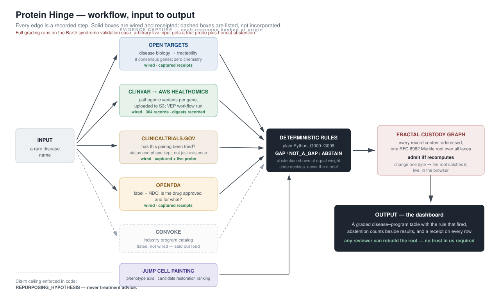
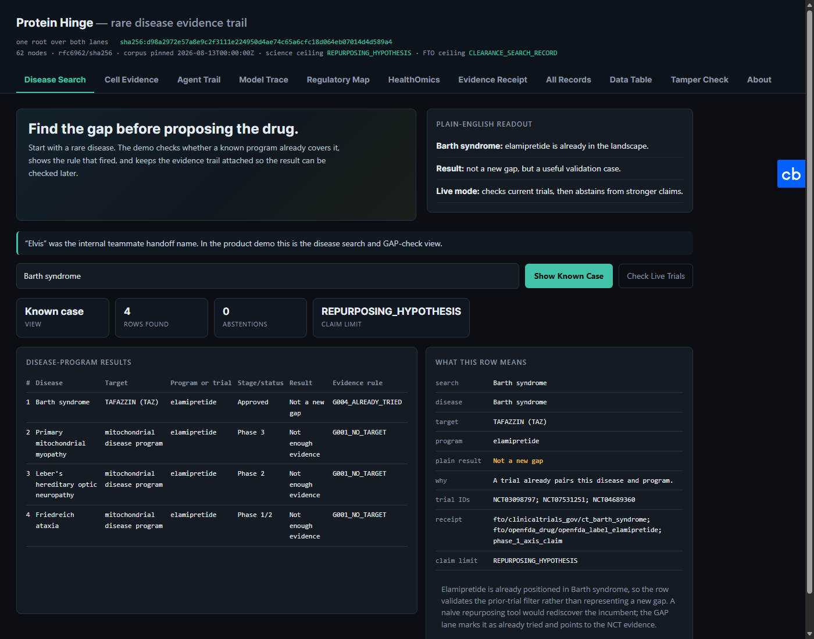
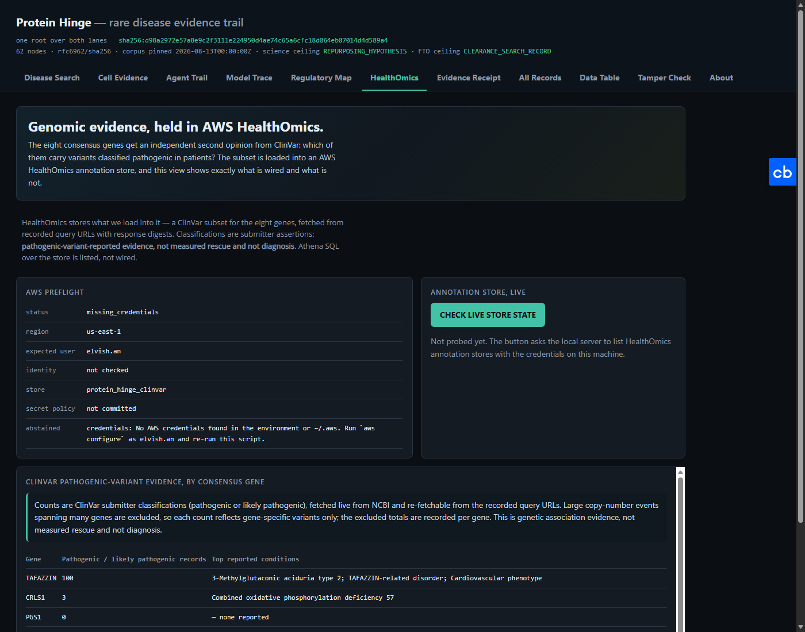

# Protein Hinge Pitch Deck

Structured as a startup pitch: problem → approach → demo → why it's different →
who cares. Plain language throughout; the technical depth lives in the demo.

## Slide 1 — Title

**Protein Hinge: find the untried drug — and prove your work.**

Type in a rare disease. Get back existing drugs graded as *genuine gap*,
*already tried*, or *we cannot say* — with a receipt on every claim that anyone
can verify on their own machine.

## Slide 2 — The problem (the hackathon's own problem statements)

Of the challenge tracks suggested at the start of this hackathon, we took aim
at four — because they are the same problem wearing four coats:

1. **More efficient trials** — trials are re-run against diseases where the
   same drug already failed, because nobody can audit the history.
2. **Repurposing opportunities** — over 90% of rare diseases have no approved
   treatment while plausible existing drugs sit untried.
3. **Traceability** — AI tools propose drug–disease matches with no record of
   what evidence produced the score. Confident guesses and auditable findings
   look identical.
4. **Reducing redundant development at scale** — every company privately
   re-derives the same landscape because no shared output can be trusted.

The common root: **rankings without receipts.** Fix the receipt and all four
get better at once.

## Slide 3 — What the field does, and what we do

**The field:** TxGNN, Every Cure's MATRIX, Healx score millions of pairs with
machine learning; Citeline sells the landscape by subscription. Good at
ranking — but black boxes. No receipts, no "we don't know."

**Us, in two sentences:** We grade drug–disease pairings with nine simple,
readable rules over five public evidence sources, and fingerprint every piece
of evidence so the output can defend itself. The AI helps present; it never
decides.

## Slide 4 — The workflow (input → output)

Three phases. **Input:** a rare disease name. **Output:** a graded table with
a verifiable receipt on every row.

| Phase | What happens | Tech |
|---|---|---|
| **GATHER** | Five public sources, one question each, every response hashed at capture: Open Targets (broken biology), ClinVar → **AWS HealthOmics** (patient genetics), ClinicalTrials.gov (prior attempts, with status), openFDA (approval), JUMP Cell Painting (phenotype evidence) | Python, GraphQL/REST, NCBI E-utilities, boto3 + S3 + IAM + HealthOmics annotation store |
| **GRADE** | Rules G000–G008 grade each pairing GAP / NOT_A_GAP / ABSTAIN; abstentions shown at equal weight | Plain Python — no ML in the decision |
| **PROVE** | Every record content-addressed under one RFC 6962 Merkle root; verified client-side; live tamper demo | fcg.py, SQLite, sql.js (WASM), vanilla JS |

Convoke (industry program catalog) is drawn dashed: listed, deliberately not
wired, and we say so.

## Slide 5 — Demo: Disease Search

- Input "Barth syndrome" → four graded rows.
- Elamipretide fires `G004_ALREADY_TRIED` → **NOT_A_GAP**, with the three NCT
  trial IDs attached. A naive tool would "discover" the incumbent; ours
  refuses, and shows why.
- The abstention counter sits beside the results, always visible.

## Slide 6 — Demo: AWS HealthOmics (the genetic second opinion)

- 355 gene-specific pathogenic-variant records pulled from ClinVar for the
  eight consensus genes; every query URL and response digest recorded — and
  287 whole-chromosome copy-number events that naive pipelines would count
  were excluded, with the exclusions recorded per gene.
- TAFAZZIN: 100 pathogenic records, top condition *3-Methylglutaconic aciduria
  type 2* — which **is** Barth syndrome. The genetics independently agrees
  with the disease biology. Four of the eight genes honestly show zero.
- The evidence is **live in AWS**: the subset TSV and its provenance are
  uploaded digest-keyed to the account's HealthOmics S3 bucket, and our own
  VEP annotation run (`protein-hinge-vep-…`) executed on the account's
  HealthOmics workflow.
- The event's service control policy denies the deprecated annotation-store
  API — and the dashboard's live probe **records that denial as a receipt**
  next to the working stores, workflows, and runs. Honesty, demonstrated
  against a real permission boundary.

## Slide 7 — Demo: cell evidence

- Public JUMP Cell Painting profiles; a genetic perturbation moves cells away
  from the reference state; 50 candidates ranked by how far back they move it.
- Labeled as what it is: predicted counter-perturbation, **not measured
  rescue**.

## Slide 8 — Demo: the tamper check

- The browser re-hashes all 62 records, rebuilds the Merkle tree, and matches
  the published root — trusting nothing.
- Then we change one byte of one record: the root moves, and the first
  divergent node is named. **A changed evidence record is detectable without
  trusting our server.**

## Slide 9 — Why we're different

Anyone can join four databases and rank drug pairings. Nobody else hands a
stranger a receipt that verifies without trusting them.

- **Deterministic over black-box:** readable rules decide; the model phrases.
- **Abstention as a first-class answer:** "we cannot say" is displayed at the
  same volume as results.
- **Custody over claims:** recomputed vs. origin-attested evidence is an
  explicit, rendered distinction.
- **Honest wiring:** what isn't integrated is drawn dashed and said out loud —
  Convoke, Athena SQL, EMA/PMDA coverage.
- **We show our own negative results:** the cell-evidence benchmark's null
  comparison is conservative — the known pair did not beat the shuffle null in
  the small cached run — and the dashboard displays that rather than hiding
  it. A system that only ever agrees with itself proves nothing.

TxGNN can't tell you which predictions to distrust. Citeline can't show its
receipts. We can.

## Slide 10 — Who cares (the four P's)

| Perspective | What this gives them |
|---|---|
| **Patient** | The `ALREADY_TRIED` rows are real registered trials, with NCT IDs — questions to bring to their physician, never treatment advice. |
| **Provider** | An auditable trail from any suggestion back to source records — the difference between a lead and a liability. |
| **Policymaker** | Tamper-evident evidence and explicit claim ceilings: an audit substrate for AI-assisted discovery, not another black box to regulate blind. |
| **Payer** | Repurposed approved drugs are the cheapest path to rare-disease coverage; graded gaps with receipts show where that path actually is. |

One table, four readings. Rare disease is the wedge — any disease ID runs the
same pipeline.

## Slide 11 — Guardrails

- Science ceiling: `REPURPOSING_HYPOTHESIS` — enforced in code.
- FTO ceiling: `CLEARANCE_SEARCH_RECORD`; the lane refuses `FTO_OPINION`.
- No treatment, efficacy, or measured-rescue claims, ever.
- Live surfaces label exactly what they probe and abstain from the rest.

## Slide 12 — Citations

- Fractal Custody Objects v4/v5: https://doi.org/10.5281/zenodo.21829929
- Custody-Verified Classification of AI Model Outputs: https://doi.org/10.5281/zenodo.21830287
- Shadow Dogma governed computational evidence package: https://doi.org/10.5281/zenodo.21830361
- XenoDisorder bounded evidence package: https://doi.org/10.5281/zenodo.21830386
- RFC 6962 Merkle audit tree: https://www.rfc-editor.org/rfc/rfc6962.html
- MMR diversity reranking: https://doi.org/10.1145/290941.291025

## Slide 13 — The ask

Use Protein Hinge as the custody layer for phenotype-first discovery:

- Publish small, inspectable evidence packages instead of unauditable scores.
- Keep clearance-search records beside science claims.
- Make tamper detection something a judge can click, not a promise in a paper.
